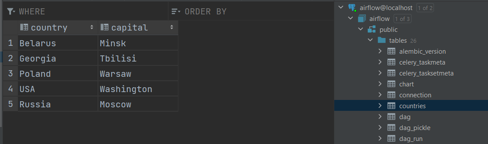

## Task 1
* cd docker-airflow
1. docker build -t puckel/docker-airflow:1.10.9 .

2. docker compose up -d

* cd ..
3. mvn clean package

4. docker build -t khan/weather:1.0 .

* Go to localhost:8080/admin/variable/
5. Add variable "weather_api" with key "https://api.weatherapi.com/v1/current.json?key=fcdf56c286944c8c8be150113210411&q=Minsk&aqi=no"

6. Manually trigger the DAG, wait for all 3 tasks to succeed

7. View logs

## Task 2
1. Upload archive to S3, modify the name in DAG accordingly
2. Add connections on Airflow UI:
    1. AWS. Login is 'aws_access_key_id' and password is 'aws_secret_access_key'
   
    2. Postgres
   
3. Before DAG run

4. After DAG run

